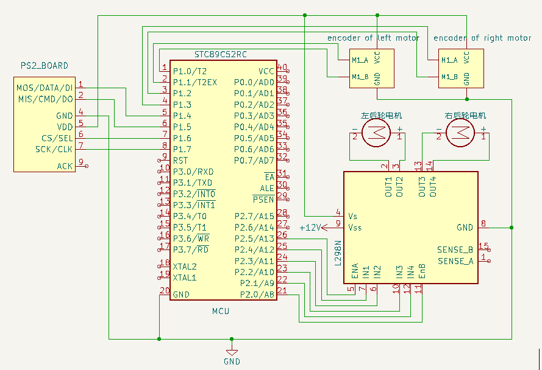
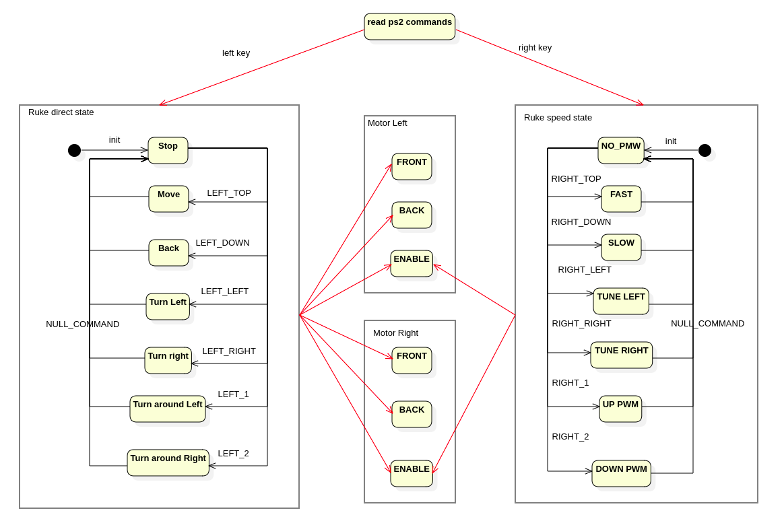
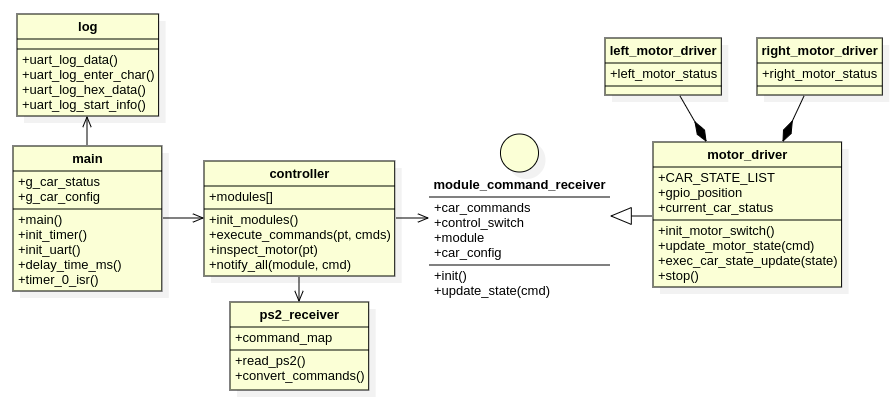
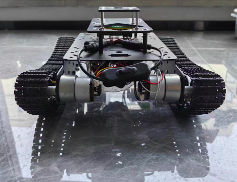
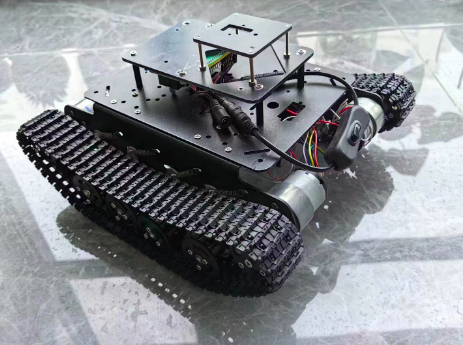

# Rush Tank
Rush Tank(简称Ruke)是利用51单片机、L298N电机驱动、PS2手柄、坦克坦克底盘、1000RPM的带霍尔效应编码器的JGB37 520调速电机DIY实现的PS2摇控坦克，提供精确速度控制，加减速，遥控体验绝佳。

## 功能说明
#### 遥控坦克正常行驶
可通过PS2左侧摇杆控制坦克前进、后退、左转、右转。

#### 加减速控制
可通过PS2右侧摇杆控制坦克加速、减速、向左前行进、向右前行进。

## 设计说明

#### 硬件设计

详细参照：[硬件设计说明](hardware/README.md)

#### 软件设计
##### 实现原理及状态图
如硬件设计所示，RUKE采用两组电机控制，使用L298N电机驱动控制实现RUKE行驶控制。采用PS2手柄作为控制输入。
因此，RUKE实现原理就是将PS2命令接收转换成控制L298N的信号即完成RUKE行驶控制。

L298N分两路电机控制，每路电机有三个信号引脚： 输入1（后文叫FRONT），输入2（后文叫BACK），使能（后文叫ENABLE）。
控制状态如下：
- 输入1=1， 输入2=0， 前进方向。 使能引脚默认接高电平，也可通过PWM控制速度。
- 输入1=0， 输入2=1， 后退方向。
- 输入1=0， 输入2=0， 停止。

因此RUKE实现逻辑是：
- 前进：两个电机都前进方向，使能全部高电平。
- 后退：两个电机都后退方向，使能全部高电平。
- 左转：左侧电机停止，右侧电机前进。
- 右转：右侧电机停止，左侧电机前进。
- 左向调头：左侧电机后退，右侧电机前进。
- 右向调头：右侧电机后退，左侧电机前进。
- 调速、左右向微调都是通过对ENABLE信号脚进行PWM控制实现速度微调。

因此，RUKE状态设计如下图，分小车行驶方向状态、速度状态两种状态，分别由PS2左、右两侧摇杆控制：

##### 详细类图设计

详细参照：[软件设计说明和代码](software/README.md)

## PS2按键功能

| 按键     | 功能                         | 监控指示灯 |
| -------- | ---------------------------- | ---------- |
| 左侧上键 | 坦克前进，长按有效，放开停止                  | P0_0       |
| 左侧下键 | 坦克后退，长按有效，放开停止                  | P0_1       |
| 左侧左键 | 坦克左转，长按有效，放开停止                  | P0_2       |
| 左侧右键 | 坦克右转，长按有效，放开停止                  | P0_3       |
| 左侧1键  | 顺时针快速调头                              | P0_4       |
| 左侧2键  | 逆时针快速调头                              | P0_5       |
| 右侧上健 | 加速行驶                                  | P0_0       |
| 右侧下键 | 减速行驶                                  | P0_1      |
| 右侧左键 | 坦克向左微调80%PWM，长按有效，放开恢复正常行驶  | P0_2       |
| 右侧右键 | 坦克向右微调80%PWM，长按有效，放开恢复正常行驶  | P0_3       |
| 右侧1键  | 同时按住左侧健时，直接最大速度行驶。 不按左侧健时，微调行驶角度，PWN加20%         | P0_4       |
| 右侧2键  | 同时按住左侧健时，直接最小速度行驶。 不按左侧健时，微调行驶角度，PWN减20%         | P0_5       |

## 成品效果

##### 视频

https://www.bilibili.com/video/BV1Zu411p7aM/?spm_id_from=333.999.0.0

## 硬件模块及工具清单：

| 模块          | 说明                                                         | 价格(元) |
| ------------- | ------------------------------------------------------------ | -------- |
| 51单片机      | 单片机 STC89C52RC芯片，11.0592晶振。                         | 40       |
| 坦克底盘      | 坦克底盘及M3铜柱螺丝若干，底盘带4个直流电机。                | 350       |
| ps2手柄       | 无线的那种，会带接收器。                                     | 40       |
| L298N电机驱动 | 12V供电，同时带5V输出电压。                                  | 4        |
| JGB37 520减速电机  | JGB37 520减速电机 * 2              | 每个35元       |
| 电池及充电器  | 12V锂电池和12V充电器                                         | 35       |
| 各种接线      | 各种公对公，母对母杜邦线若干，DIY铜线，漆包线，转接头，接线器等 | 10       |

另外音乐芯片组装需要电烙铁焊接，组装时可能需要万用表做些测试。如果对焊接不熟悉，还是买现成的模块比较合适。以上东西都可以在网上买到。

## 使用的相关工具软件：

#### OS： Ubuntu 20.04

#### 硬件设计工具KiCAD

安装：https://docs.kicad.org/5.1/zh/getting_started_in_kicad/getting_started_in_kicad.html

#### 软件设计开发工具:

- 软件设计工具： StarUML  https://staruml.io/download

- 开发IDE： VSCODE

- 编译软件： sdcc/packihx, cmake

ubuntu下安装： sudo apt-get install sdcc

- 烧录软件：stcflash

ubuntu下安装： 从社区下载到本地，社区地址：https://github.com/laborer/stcflash

将stcflash.py文件解压到/usr/local/bin。 并去掉后缀名。

- 依赖： python3, python-pip3, python serial

安装python serial: https://www.geeksforgeeks.org/how-to-install-python-serial-package-on-linux/

如果执行: stcflash报错： usr/bin/env: ‘python’: No such file or directory

执行以下命令解决： sudo ln -s /usr/bin/python3 /usr/bin/python

- 串口调试工具： comtool

安装： sudo pipe3 install comtool