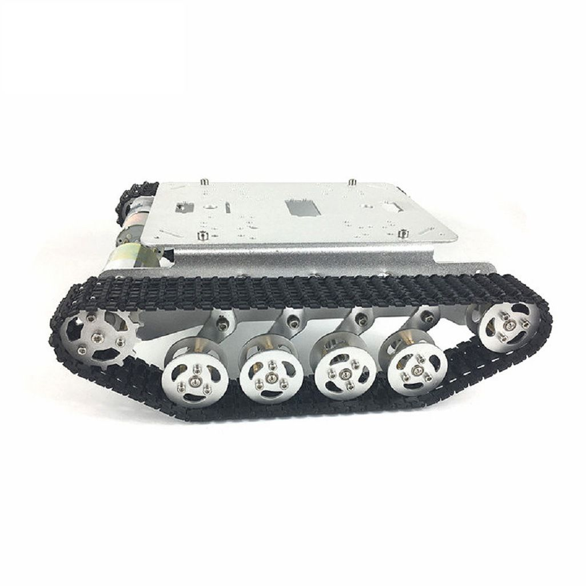

## 整体设计

## 模块说明

#### 坦克底盘

外购坦克底盘。

#### JGB37 520带霍尔编码器减速电机

外购坦克底盘。

#### 控制模块

使用51单片机（STC89C52RC）作为控制中心，其中P0口系列自带LED灯，为指令监控显示灯； P2.0-P2.5 为电机控制口，P2.6 为音乐开关。P2.7为灯组开关，P1.4-P1.7为PS2通信口。
晶振频率：11.0592

| GPIO | 连接口                        | 初始值  | 说明        |
| ---- | ----------------------------- | ------- | ----------- |
| P2_0 | L298N_EnB 右轮使能            | 0       |             |
| P2_1 | L298N_IN4 右轮前进高电平      | 0       |             |
| P2_2 | L298N_IN3 右轮后退高电平      | 0       |             |
| P2_3 | L298N_IN2 左轮前进高电平      | 0       |             |
| P2_4 | L298N_IN1 左轮后退高电平      | 0       |             |
| P2_5 | L298N_EnA 左轮使能            | 0       |             |
| P1_0 | 左电机B信号                   | 0       |            |
| P1_1 | 左电机A信号                   | 0       |            |
| P1_2 | 左电机B信号                   | 0       |            |
| P1_3 | 左电机A信号                   | 0       |            |
| P1_4 | PS2_D1/DATA                   | default |             |
| P1_5 | PS2_D0/CMD                    | default |             |
| P1_6 | PS2_CS                        | default |             |
| P1_7 | PS2_CLK                       | default |             |
| P0_0 | 自带LED1                      | 1       | 1命令时点亮 |
| P0_1 | 自带LED2                      | 1       | 2命令时点亮 |
| P0_2 | 自带LED3                      | 1       | 3命令时点亮 |
| P0_3 | 自带LED4                      | 1       | 4命令时点亮 |
| P0_4 | 自带LED5                      | 1       | 5命令时点亮 |
| P0_5 | 自带LED6                      | 1       | 6命令时点亮 |
| P0_6 | 自带LED7                      | 1       | 7命令时点亮 |
| P0_7 | 自带LED8                      | 1       | 8命令时点亮 |

#### 电机驱动模块

使用L298N电机驱动，左右轮分两组控制。

12V输入电压，5V输出电压为控制单板、音乐板、LED灯、PS2通信模块供电。

#### 遥控通信模块

使用PS2通信模块进行遥控。控制键说明：

| 按键     | 功能                         | 监控指示灯 |
| -------- | ---------------------------- | ---------- |
| 左侧上键 | 坦克前进，长按有效，放开停止 | P0_0       |
| 左侧下键 | 坦克后退，长按有效，放开停止 | P0_1       |
| 左侧左键 | 坦克左转，长按有效，放开停止 | P0_2       |
| 左侧右键 | 坦克右转，长按有效，放开停止 | P0_3       |
| 右侧上健 | 坦克加速，每按一次提速一格，放开保持当时速度     | P0_4       |
| 右侧下键 | 坦克减速，每按一次减速一格，放开保持当时速度     | P0_5       |
| 右侧左键 | 坦克左前行驶，每按一次左偏一格，放开保持偏转角度  | P0_6       |
| 右侧右键 | 坦克右前行驶，每按一次右偏一格，放开保持偏转角度  | P0_7       |
| 左侧1键  | 坦克复位，恢复系统初始化速度和角度             | P0_0       |
| 左侧2键  | 坦克停止                                  | P0_1       |
| 右侧1键  | 坦克按最大速度行驶                          | P0_2       |
| 右侧2键  | 坦克按最小速度行驶                          | P0_3       |

